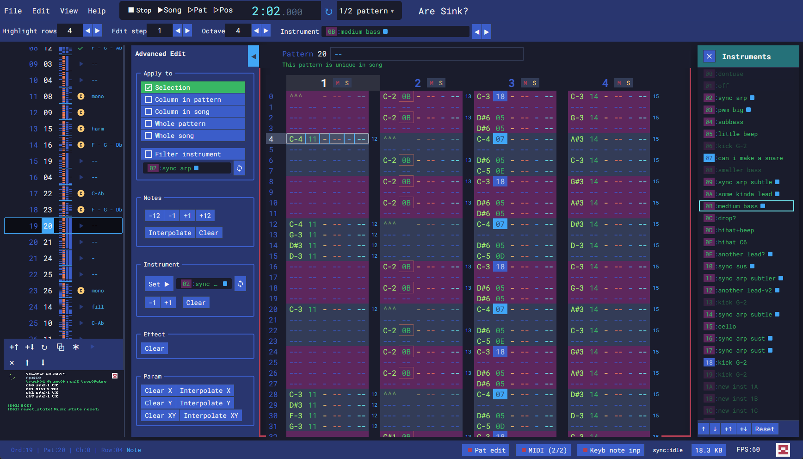
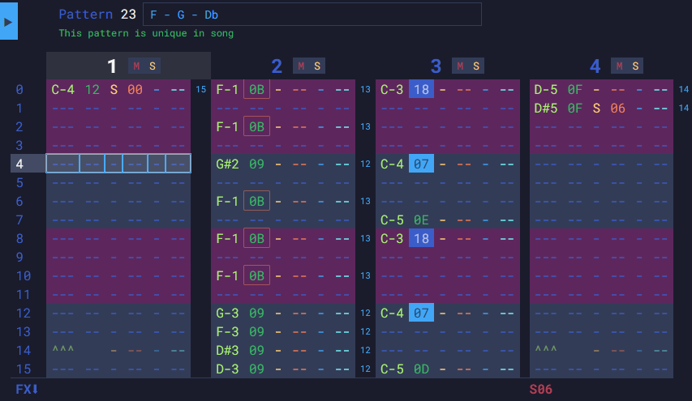
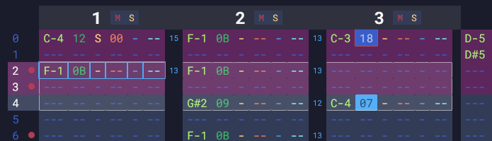
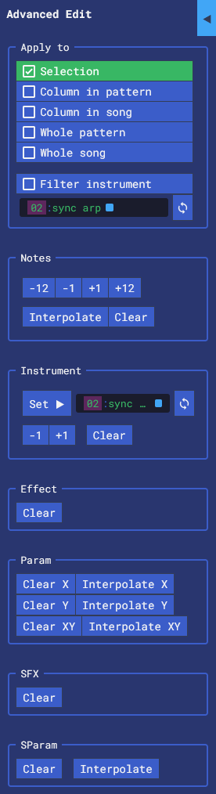
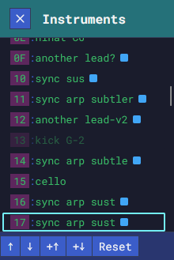
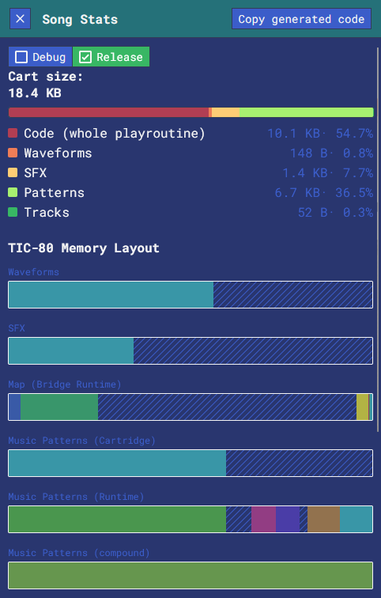

# Somatic: A music tracker for the TIC-80

## try it

Live @ https://somatic.tenfourmusic.net

## Main features

* MIDI device support
* export as `.tic` cartridge
* ability to import music from existing tic carts
* Guaranteed sound accuracy because it uses a real TIC-80 as the sound engine.
* supports long songs (255 frames)
* Saves your current workspace locally so you always start where you left off.
* Dynamic instrument waveform rendering (tick-based "K-rate" rendering)
  * PWM synthesis
  * Lowpass filter automation
  * Waveform crossfading ("gradients")
  * wavefolding shaper
  * Hard sync
  * LFO & envelope modulation
  * Sample import & slicing
* Tracker ergonomics
  * show carried-over effect status at end of pattern
  * show usage of patterns / instruments
  * highlighting current instrument
  * Pattern thumbnails shown on the song order to get a complete "minimap" of the song, with highlighting of the current instrument.
  * warnings on pattern editor
  * allow highlight color for specific instruments
  * allow naming patterns, instruments
  * allow markers for song order
* Light/dark mode themes
* Keyboard support
  * keyboard note input should be more keyboard-layout-agnostic
  * all keyboard shortcuts can be configurable and saved to localstorage / exported
  * tooltips over most commands revealing shortcut
  * almost every command can be configured with a keyboard shortcut
* transport
  * Mute/Solo per channel
  * looping modes
* pattern editing features
  * block operations
  * transpose, instrument, command interpolation
  * Copy/paste supported everywhere
  * arranger editing
  * Undo/redo support
  * box selection in song order + operations like duplicate, move selection
* Song optimizations
  * Show unused waveforms, sfx, and patterns don't become part of the exported cart.
  * Show compression journey: pattern data is bloaty and gets optimized and compressed
  * Live insights about the size of the song (size of resulting code, playroutine, song data, cart size...)
* Extras
  * Tools for encoding/decoding base64, hex-encoded, base85 and LZ-compressed Lua strings.
  * a built-in Lua minifier

## Somatic pattern commands

additional per-pattern effect columns

* **E**: Effect strength scale (00=bypass, FF=max)
* **L**: Set LFO phase (00-FF)
* **F**: set filter strength (00-FF, only if LP is enabled on the instrument)

## export procedure / how to use in a demo

To use a Somatic track in your demo,

- export as a cartridge via the file menu
- your demo can now import the music data from this cart
- and you can copy/paste the code as the playroutine.
- NOTE: Even though Somatic has a lot of stuff outside of the built-in music routine, all of its data gets stored in music blocks in the .tic cart, and in the Lua playroutine code.
- NOTE: Export only supports Lua for the playroutine.

All your demo needs to do is

```lua
function TIC()
	somatic_tick()
  ...
end

```

You can get realtime frame and row data from `somatic_get_state()`. See the default exported
playroutine to see how it can be used for sync / playback control.

```lua
local track, currentFrame, currentRow = somatic_get_state()
print(string.format("t:%d f:%d r:%d", track, currentFrame, currentRow), 0, 0)
```

## motivations / history

This started as a fork of https://reverietracker.github.io/chromatic/. However, Somatic has basically nothing related to the original anymore. Sound engine, UI, pattern, playroutine have all been
since replaced.

Somatic has 2 main goals:

1. be an ultra-ergonomic UX. to be "the ultimate tracker UX"
2. provide reasonably-musical playroutine that augments the built-in TIC-80 music routine.

## issues / limitations

this was made like, yesterday. it has bugs. file them @ https://github.com/thenfour/Somatic/issues

Other stuff worth metioning:

* Mobile: Absolutely will not be a good experience on mobile / small screens. This thing works like a 
  desktop app and wants mouse + keyboard.
* There are quirks due to using the embedded TIC-80, and the goofy playroutine. Instrument/waveform
  updates tend to be updated in real-time, but pattern/order changes, or changing looping mode
  requires stopping / playing again to hear the change.

## How does it work

A TIC-80 lives in an `<iframe>`, and Somatic establishes 2-way communication with it
through a custom cart called "bridge.tic" (source of bridge is @ `/bridge/bridge.lua`).
Based on that, Somatic can write to TIC-80 memory, and tell the bridge to do things like play, stop, etc.


### Why an `<iframe>`?

because the tic80 will capture input from its whole `document` which conflicts with Somatic. It has to be isolated.

## dev stuff

```

npm install
npm start
npm run typecheck
npm run tests
npm run build
npx serve


```

### bridge.lua and playroutine.lua

The tracker's embedded TIC-80 loads a cart that's built as part of the project build process.
The `build-bridge` webpack plugin, `bridge.lua`, gets injected with a bunch of stuff (constants 
from memory map / TIC-80 constants / shared playback Lua routines), and built into a .tic cart.

`build-bridge` is also run automatically at runtime when relevant files are changed. It's finnicky though.

`playroutine.lua` is a template that is used for exporting the song.

### Song's journey from UI to TIC80.

The `Song` in Somatic's editor largely resembles the built-in TIC-80 song format,
with a bunch of differences (>16 frames supported, various waveform effects, etc)

The playroutine uses the built-in `music()` TIC-80 function, so there's a lot of
conversion that goes on between Somatic and the exported cartridge.

- **Baking**: your play options (channel muting, looping, selection) change the song that gets played by the TIC-80. For example if you choose to loop a 4-row bit of song, it gets converted to a song with only those 4 rows, looped.
- **Optimization**: detecting which instruments, waveforms, patterns are unused or duplicates, removing them and sliding them to be together. We also break Somatic patterns into 4 individual channels (the way
TIC-80 does patterns)
- **Transmission**:
  - For Somatic tracker's live web play, we `POKE` it into the TIC-80's memory in a way that the runtime playroutine can use.
    - Waveform and sfx are placed directly in the standard WAVEFORM and SFX memory locations
    - song order ("frames") & pattern data get stuffed in the large graphics memory area so the playroutine can blit from it.
  - For exported carts, we do similar for waveform & sfx, however Pattern & frame data get exported an Lua strings, encoded & compressed.

## screenshot gallery (WIP)

### the app



### pattern editor



* Set pattern names
* See if this pattern is used in the song (& how many times)
* Mute/Solo controls
* Columns: Note, instrument, effect, param XY, somatic command, somatic param
* Current instrument is highlighted with an orange box
* Instruments can be configured to display with different colors (18 and 07 are blue for drums)
* Effect carry-over is displayed at the bottom of the pattern
* shows other useful tech data; in this case some waveform rendering info is displayed



* Box-selection and block operations
* Warnings are shown when tech conflicts are detected

### pattern advanced edit panel



* Select where thes block ops will be applied (you can make whole-song adjustments here)
* You can also choose to apply edits to a single instrument.
* Sync button sets the value to the current instrument
* Transpose notes by octave or semitone
* Interpolate notes (select a region, this will fill in all notes between with a ramp)
* Clear note column
* Set to instrument
* increment / decrement instrument
* Clear instrument column
* Clear effect column or Somatic FX column
* Clear or interpolate the effect param columns (X only, Y only, or XY together)

### waveform editor


### SFX (Instrument) editor


### arrangement editor ("song order" / "frames"...)


### instruments mgmt panel



### export cart / song stats



