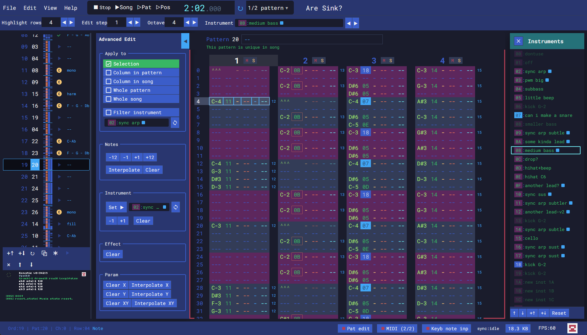
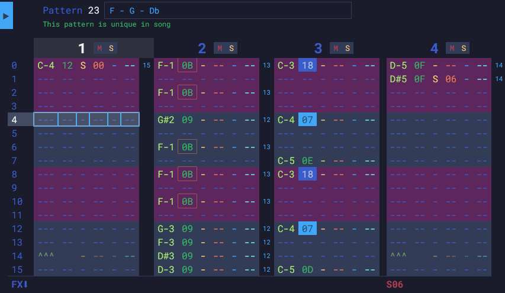
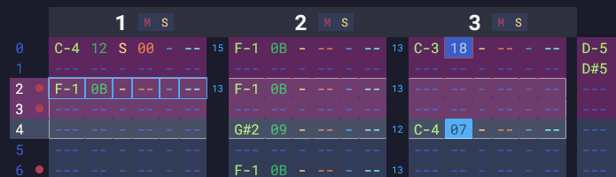
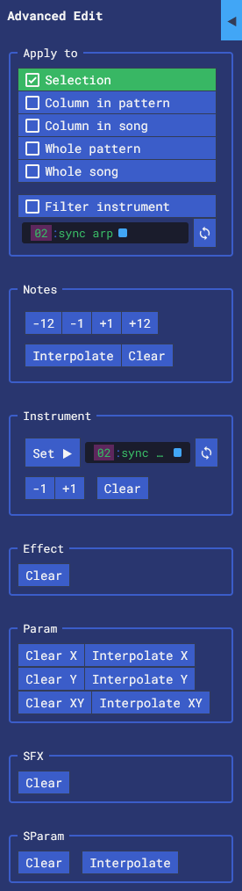
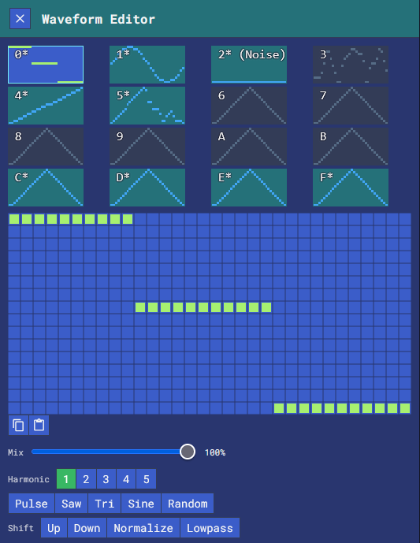
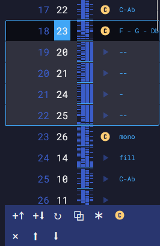
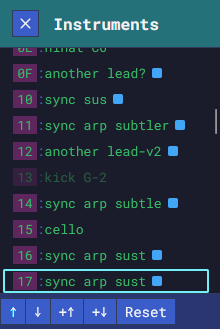
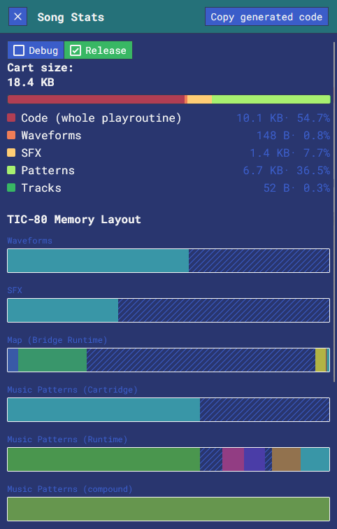

# Somatic: A music tracker for the TIC-80

## try it

Live @ https://somatic.tenfourmusic.net

## Main features

- MIDI device support
- export as `.tic` cartridge
- ability to import music from existing tic carts
- Guaranteed sound accuracy because it uses a real TIC-80 as the sound engine.
- supports long songs (255 frames)
- Saves your current workspace locally so you always start where you left off.
- Dynamic instrument waveform rendering (tick-based "K-rate" rendering)
  - PWM synthesis
  - Lowpass filter automation
  - Waveform crossfading ("gradients")
  - wavefolding shaper
  - Hard sync
  - LFO & envelope modulation
  - Sample import & slicing
- Tracker ergonomics
  - show carried-over effect status at end of pattern
  - show usage of patterns / instruments
  - highlighting current instrument
  - Pattern thumbnails shown on the song order to get a complete "minimap" of the song, with highlighting of the current instrument.
  - warnings on pattern editor
  - allow highlight color for specific instruments
  - allow naming patterns, instruments
  - allow markers for song order
  - show musically-relevant/useful insights
   - Delay shows time in milliseconds and ticks
   - Vibrato shows range in semitones/cents and frequency
   - Song speed/tempo show how it will affect row timings and show timing quantization error.
- Light/dark mode themes
- Keyboard support
  - keyboard note input should be more keyboard-layout-agnostic
  - all keyboard shortcuts can be configurable and saved to localstorage / exported
  - tooltips over most commands revealing shortcut
  - almost every command can be configured with a keyboard shortcut
- transport
  - Mute/Solo per channel
  - looping modes
- pattern editing features
  - block operations
  - transpose, instrument, command interpolation
  - Copy/paste supported everywhere
  - arranger editing
  - Undo/redo support
  - box selection in song order + operations like duplicate, move selection
- Song optimizations
  - Show unused waveforms, sfx, and patterns don't become part of the exported cart.
  - Show compression journey: pattern data is bloaty and gets optimized and compressed
  - Live insights about the size of the song (size of resulting code, playroutine, song data, cart size...)
- Extras
  - Tools for encoding/decoding base64, hex-encoded, base85 and LZ-compressed Lua strings.
  - a built-in Lua minifier

## Features that are less obvious

- <kbd>Esc</kbd> enables keyboard editing in the pattern grid.
- <kbd>Shift+Backspace</kbd> inserts a note-off in the pattern grid.
- <kbd>Ctrl+Click</kbd> on a note or instrument column to select that instrument.
- holding <kbd>Shift+drag</kbd> while drawing on the waveform editor canvas draws straight lines
- <kbd>Ctrl+Click</kbd> on a knob will reset it to default value
- <kbd>Shift+drag</kbd> on a knob for fine control

## Somatic pattern commands

additional per-pattern effect columns that do Somatic-specific things

- **E**: Effect strength scale (00=bypass, FF=max)
- **L**: Set LFO phase (00-FF)
- **F**: set filter strength (00-FF, only if LP is enabled on the instrument)

## How to export / how to use in a demo

To use a Somatic track in your demo,

- configure the song's export configurations in Song Settings
- export any configured cartridge via File -> Export Cart
- your demo can now import the music data from this cart
- and you can copy/paste the code as the playroutine.
- NOTE: Even though Somatic has a lot of stuff outside of the built-in music routine, all of its data gets stored in music blocks in the .tic cart, and in the Lua playroutine code.
- NOTE: Export only supports Lua for the playroutine.

All your demo needs to do is

```lua
function TIC()
	local state = somatic_tick()
	-- drive visuals from state.demoBeats / state.demoPatternIndex / state.demoPatternRow
	...
	somatic_end_frame()
end
```

`somatic_tick()` returns the current external transport state. `demoBeats` is the preferred sync
value for animation; pattern and row fields are also included for tracker-style sync.

```lua
local state = somatic_tick()
print(string.format("beat:%.2f pat:%d row:%d", state.demoBeats, state.demoPatternIndex, state.demoPatternRow), 0, 0)
```

public API:

```lua
somatic_tick(wallDeltaMillisOverride, syncOffsetMS) -- call once per TIC frame; returns state
somatic_get_time(syncOffsetMS)                      -- read state without advancing time
somatic_get_raw_time()                              -- read music transport state without sync correction
somatic_project_time(state, syncOffsetMS)           -- project a state through a time offset
somatic_seek(beat, syncOffsetMS)                    -- seek to an external beat, including fractional beats
somatic_position_to_beat(songOrderIndex, row)       -- convert a 0-based song position and row to a beat
somatic_seek_position(songOrderIndex, row, syncOffsetMS) -- seek to a zero-based song position and row
somatic_set_options(options)                        -- tempo/speed/isPlaying/isMuted/loopSongForever/syncOffsetMS
somatic_set_completion_callback(callback)           -- register a natural song-completion callback; nil unregisters
somatic_set_row_callback(callback)                  -- register an observed-song-row callback; nil unregisters
somatic_advance_frame()                             -- advance paused demo time by one 60Hz frame
somatic_end_frame()                                 -- for internal bookkeeping
```

`somatic_seek()` keeps `demoBeats` / `demoMillis` continuous for animation. TIC-80 audio can
only start on integer rows, so a fractional seek may produce a short silence until the next row
boundary before music resumes.

Song positions and rows are zero-based. A song position is an index into
the rendered song order, not the index of an underlying pattern.

`somatic_set_completion_callback()` keeps one callback registered until it is replaced or
unregistered with `nil`. The callback runs once after each natural, non-looping song completion,
after playback has stopped. Pausing, muting, seeking, and explicit stops do not invoke it. Register
the callback before the first `somatic_tick()` if the song could finish before later setup runs.

```lua
somatic_set_completion_callback(function()
	-- quit, do something...
end)
```

`somatic_set_row_callback()` fires for each encountered new row during playback.
fires on the first row. Read `state.sideChannel` to get the string. Only one callback supported at a time.

```lua
somatic_set_row_callback(function(state)
	if state.sideChannel == "flash" then
		-- trigger animation
	end
end)
```

Side-channel strings are per pattern-row. Can contain only the printable 7-bit
ASCII characters. Maximum size enforced.

`syncOffsetMS` is a presentation-only latency correction in system milliseconds. Positive values
advance the returned external transport time. It does not change internal music playback state;
`somatic_get_raw_time()` exposes that unprojected state.

Transport state includes timing settings, play state, wall-clock fields, demo-clock fields, and song
length fields. "Wall clock" refers to the clock on your wall rather than in the song/demo.
The wall clock ticks even when the demo is paused. Useful for debug huds etc.

```lua
state.tempo
state.speed
state.rowsPerBeat
state.rowsPerPattern
state.isPlaying
state.isMuted
state.loopSongForever
state.didSeek
state.playbackRate
state.syncOffsetMS

state.wallFrame
state.wallDeltaMillis
state.wallMillis

state.demoMillis
state.demoDeltaMillis
state.demoBeats
state.demoDeltaBeats
state.demoPatternIndex
state.demoPatternRow
state.sideChannel -- current pattern-row string, or nil

state.songPatternCount
state.songRowCount
state.songBeatCount
state.songMillis

state.rawDemoMillis -- internal time with no sync offset applied
state.rawDemoBeats  -- internal time with no sync offset applied
```

For example:

```lua
if btnp(1) then
	state = somatic_set_options({ isPlaying = not state.isPlaying })
end
if btnp(2) then
	state = somatic_seek(math.max(0, state.demoBeats - 1))
end
if btnp(3) then
	state = somatic_seek(math.min(state.songBeatCount, state.demoBeats + 1))
end
```

`tempo` and `speed` can be overridden together for slowed playback. `rowsPerBeat`
is based on Somatic's highlight rows.

## How to use with ticbuild build system

[ticbuild](https://github.com/thenfour/ticbuild) is a multi-file asset manager and build system
for TIC-80. It's easy to import a Somatic song into a `ticbuild` project.

For an example, install ticbuild and initialize a new project using the `piggybossa` template.

```bash
> npm i -g ticbuild
> ticbuild init c:\myprojects\projectname --template-name piggybossa

```

Importing is just a matter of importing chunks from the Somatic-exported `.tic` file,
and call `somatic_tick()` from your `TIC()` function.

In your `ticbuild` project manifest

```jsonc
{
  "imports": [
    // import the song cartridge like this:
    {
      "name": "song",
      "path": "path_to_your_song.tic",
    },
  ],
  "assembly": {
    "blocks": [
      // Add this to import the non-code Somatic music data
      {
        "asset": "song",
        "chunks": ["MUSIC_PATTERNS", "MUSIC_TRACKS", "WAVEFORMS", "SFX"],
      },
    ],
  },
}
```

And in your Lua code,

```Lua
--#include "import:song:CODE" -- include music routines

function TIC()
  local state = somatic_tick() -- music + transport update per frame
end
```

## motivations / history

This started as a fork of https://reverietracker.github.io/chromatic/. However, Somatic has basically nothing related to the original anymore. Sound engine, UI, pattern, playroutine have all been
since replaced.

Somatic has 2 main goals:

1. be an ultra-ergonomic UX. to be "the ultimate tracker UX"
2. provide reasonably-musical playroutine that augments the built-in TIC-80 music routine.

## issues / limitations

this was made like, yesterday. it has bugs. file them @ https://github.com/thenfour/Somatic/issues

Other stuff worth metioning:

- Mobile: Absolutely will not be a good experience on mobile / small screens. This thing works like a
  desktop app and wants mouse + keyboard.
- There are quirks due to using the embedded TIC-80, and the goofy playroutine.

## How does it work

A TIC-80 lives in an `<iframe>`, and Somatic establishes 2-way communication with it
through a custom cart called "bridge.tic" (source of bridge is @ `/bridge/bridge.lua`).
Based on that, Somatic can write to TIC-80 memory, and tell the bridge to do things like play, stop, etc.

### Why an `<iframe>`?

because the tic80 will capture input from its whole `document` which conflicts with Somatic. It has to be isolated.

## dev stuff

```

npm install
npm start
npm run typecheck
npm run tests
npm run build
npx serve


```

### bridge.lua and playroutine.lua

The tracker's embedded TIC-80 loads a cart that's built as part of the project build process.
The `build-bridge` webpack plugin, `bridge.lua`, gets injected with a bunch of stuff (constants
from memory map / TIC-80 constants / shared playback Lua routines), and built into a .tic cart.

`build-bridge` is also run automatically at runtime when relevant files are changed. It's finnicky though.

`playroutine.lua` is a template that is used for exporting the song.

### Song's journey from UI to TIC80.

The `Song` in Somatic's editor largely resembles the built-in TIC-80 song format,
with a bunch of differences (>16 frames supported, various waveform effects, etc)

The playroutine uses the built-in `music()` TIC-80 function, so there's a lot of
conversion that goes on between Somatic and the exported cartridge.

- **Baking**: your play options (channel muting, looping, selection) change the song that gets played by the TIC-80. For example if you choose to loop a 4-row bit of song, it gets converted to a song with only those 4 rows, looped.
- **Optimization**: detecting which instruments, waveforms, patterns are unused or duplicates, removing them and sliding them to be together. We also break Somatic patterns into 4 individual channels (the way
  TIC-80 does patterns)
- **Transmission**:
  - For Somatic tracker's live web play, we `POKE` it into the TIC-80's memory in a way that the runtime playroutine can use.
    - Waveform and sfx are placed directly in the standard WAVEFORM and SFX memory locations
    - song order ("frames") & pattern data get stuffed in the large graphics memory area so the playroutine can blit from it.
  - For exported carts, we do similar for waveform & sfx, however Pattern & frame data get exported an Lua strings, encoded & compressed.

## screenshot gallery (WIP)

### the app



### pattern editor



- Set pattern names
- See if this pattern is used in the song (& how many times)
- Mute/Solo controls
- Columns: Note, instrument, effect, param XY, somatic command, somatic param
- Current instrument is highlighted with an orange box
- Instruments can be configured to display with different colors (18 and 07 are blue for drums)
- Effect carry-over is displayed at the bottom of the pattern
- shows other useful tech data; in this case some waveform rendering info is displayed



- Box-selection and block operations
- Warnings are shown when tech conflicts are detected

### pattern advanced edit panel



- Select where thes block ops will be applied (you can make whole-song adjustments here)
- You can also choose to apply edits to a single instrument.
- Sync button sets the value to the current instrument
- Transpose notes by octave or semitone
- Interpolate notes (select a region, this will fill in all notes between with a ramp)
- Clear note column
- Set to instrument
- increment / decrement instrument
- Clear instrument column
- Clear effect column or Somatic FX column
- Clear or interpolate the effect param columns (X only, Y only, or XY together)

### waveform editor



### SFX (Instrument) editor

### arrangement editor ("song order" / "frames"...)



### instruments mgmt panel



### export cart / song stats



# Change log

## 1.0.10

- #189 Somatic can now act as a full transport system for demo prods. Demos tend to use
  music as the source of timing, so this codifies that.
- #188 runtime mute support
- #187 cue sheet export support

## 1.0.11

https://github.com/thenfour/Somatic/milestone/3?closed=1

- #192 allow specifying minification options for release export
- #191 fixing minification bugs that were fixed in ticbuild
- #190 playroutine transport now supports fractional row seeking
- #193 #195 ability to export a cue sheet and transport config metadata

## 1.0.12

- #197 cue sheet format updated and includes more info
- #198 adding somatic `C` pattern effect command to jump to next pattern.

## 1.0.13

- #199 adding ability to specify a sync offset time, and utilities for time projection
- #200 making `SOMATIC_MUSIC_DATA` globally visible

## 1.0.14

- #201 fixed not being able to scroll past 16 song order (oops)

## 1.0.15

- #212 fixed: song speed was different between Somatic online editor and exported cart
- #203 fixed: tooltips sometimes get stuck on
- #211 fixed: somatic "C" command was not being respected in bridge (serialization bug)
- #209 adding additional pattern marker glyphs
- #202 added better insights for effects (like showing arpeggio actual notes, links to command reference)
- #207 ability to block edit instruments. Select, delete, duplicate.
- #218 Cue sheet export fields are configurable
- #216 Song edits take effect immediately even while playing
- #213 Removed the "render waveform slot" concept, instead writing directly to the waveform register.
- #215, #217 Support for per channel L/R volume register:
  - instrument pan control
  - instrument master volume control
  - pan pattern effect
  - pan column
  - volume column
- #164 #219 #208: formatting tweaks

## 1.0.16

- #227 fixed: SOMATIC_SFX_CONFIG overflow for complex songs
- #222 fixed: changing loop mode or mute/solo wasn't hot replaying
- #229 streamline playroutine a bit
- #225 adding `somatic_position_to_beat` and `somatic_seek_position` APIs
- #228 #230 #224 UI formatting and keyboard shortcuts

## 1.0.17

- #247 fixed serialization when using bracketed Lua string representation
- #242 fixed pattern grid cursor formatting
- #245 #251 #251 #248 #233 Adding musically-useful insights for pattern effect commands, selection in pattern, waveform editors, and song speed/tempo in song settings.
- #246 added default key binding for prev/next loop mode
- #239 waveform selector shows which instruments are referencing it
- #238 expand & contract advanced edit actions
- #237 evenly distribute notes advanced edit action - for making tuplets
- #235 adding unity line for bipolar envelopes
- #226 playroutine public API adds a song completion callback

## 1.0.18 (2026-08-11)

- #252 #257 offline audio export to mp3/flac/wav
- #252 ability to disable song orders to exclude from export/playback
- #253 variable # of export configurations
- #258 ui tweak: pattern effect insights now shown as tooltip
